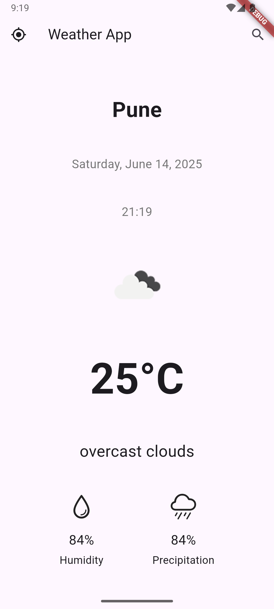
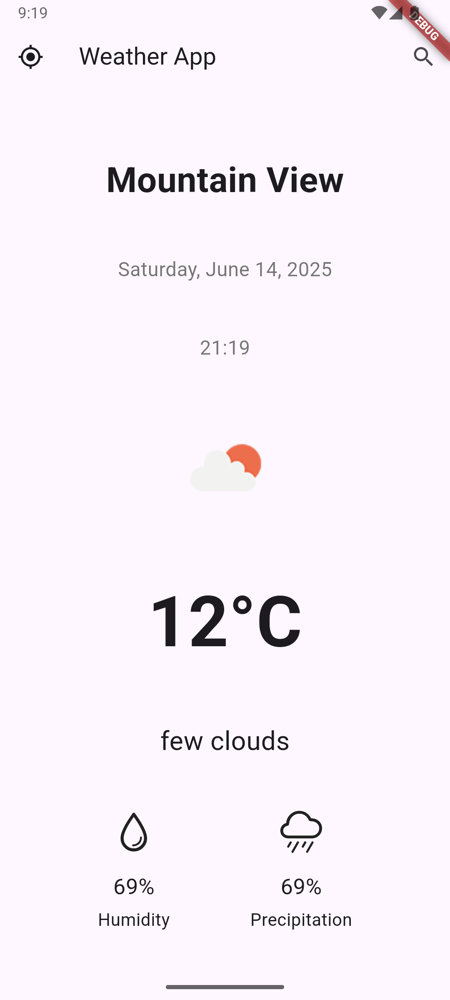
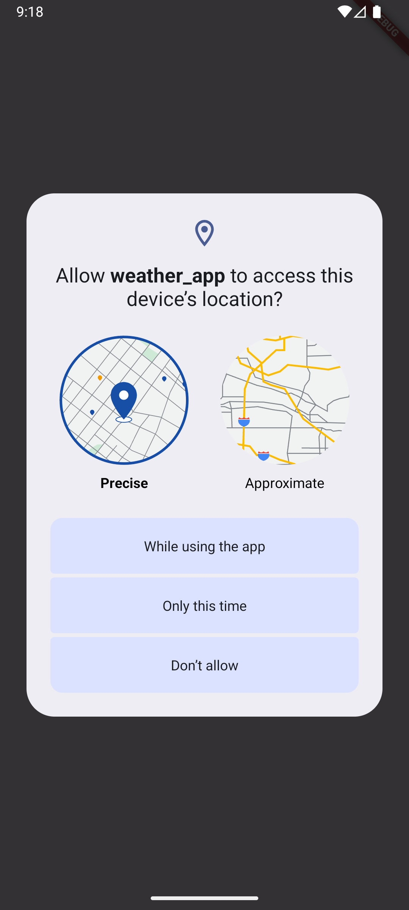

# Weather App 🌤️

A simple weather application built with Flutter that fetches and displays current weather data based on the user's location or a searched city. The app uses the OpenWeather API for weather data and includes support for location-based services.

## Table of Contents

- [Features](#features)
- [Screenshots](#screenshots)
- [APK](#apk)
- [Technologies Used](#technologies-used)
- [Setup and Installation](#setup-and-installation)
- [Usage](#usage)
- [API Integration](#api-integration)
- [Contributing](#contributing)

## Features

- 🌎 **Location-based Weather**: Automatically detects the user's current location and displays the current weather.
- 🔍 **City Search**: Allows users to search for the weather in different cities.
- 📅 **Current Date & Time**: Displays the current date, day, and time.
- 🌦️ **Weather Details**: Shows temperature, weather description, humidity, and precipitation chances.
- 🌐 **Weather Icons**: Displays weather icons corresponding to the current conditions.
- 🛰️ **Real-Time Updates**: Fetches updated weather data for new locations.

## Screenshots

|                      Weather Screen                      |                        City Search Screen                        |
|:--------------------------------------------------------:|:----------------------------------------------------------------:|
|  |  |

|                    Home Screen                     |                          Location Access Request Dialog                          |
|:--------------------------------------------------:|:--------------------------------------------------------------------------------:|
|  |  |

## APK
- [weather_app_v0.1.0-pre.apk](https://github.com/SayvIlahsiav/weather_app/releases/download/v0.1.0-pre/weather_app_v0.1.0-pre.apk)

## Technologies Used

- **Flutter**: Cross-platform UI toolkit for building natively compiled applications.
- **Dart**: Programming language used for Flutter apps.
- **Provider**: State management solution for managing weather data.
- **OpenWeather API**: External API service to fetch real-time weather data.

## Setup and Installation

### Prerequisites

- Flutter SDK: [Install Flutter](https://flutter.dev/docs/get-started/install)
- Dart SDK: Comes bundled with Flutter.
- OpenWeather API Key: You will need an API key from [OpenWeather](https://openweathermap.org/api).

### Steps

1. Clone the repository:

   ```bash
   git clone https://github.com/sayvilahsiav/weather_app.git
   ```

2. Navigate to the project directory:

   ```bash
   cd weather_app
   ```

3. Install the dependencies:

   ```bash
   flutter pub get
   ```

4. Create a file called `config.dart` in the `lib` folder and add your OpenWeather API key:

   ```dart
   // config.dart
   const String openWeatherAPIKey = 'YOUR_API_KEY';
   ```

5. Run the app:

   ```bash
   flutter run
   ```

## Usage

1. On launching, the app will automatically detect your location and show the current weather conditions.
2. Use the **location refresh button** in the top-left corner to update your location-based weather information.
3. Tap the **search button** in the top-right corner to search for the weather in a specific city.
4. Weather details such as temperature, humidity, and precipitation will be displayed along with relevant weather icons.

## API Integration

This app uses the [OpenWeather API](https://openweathermap.org/) to fetch weather data.

To set up the API:
1. Sign up for an account on OpenWeather and get an API key.
2. Add the key in `config.dart` as described above.

API endpoints used:
- **By Location**: Fetches weather data based on the user's latitude and longitude.
- **By City**: Fetches weather data by city name.

## Contributing

Contributions are welcome! If you'd like to contribute, please follow these steps:

1. Fork the repository.
2. Create a new branch (`git checkout -b feature/your-feature-name`).
3. Make your changes and commit them (`git commit -m 'Add your message'`).
4. Push to the branch (`git push origin feature/your-feature-name`).
5. Open a pull request.

